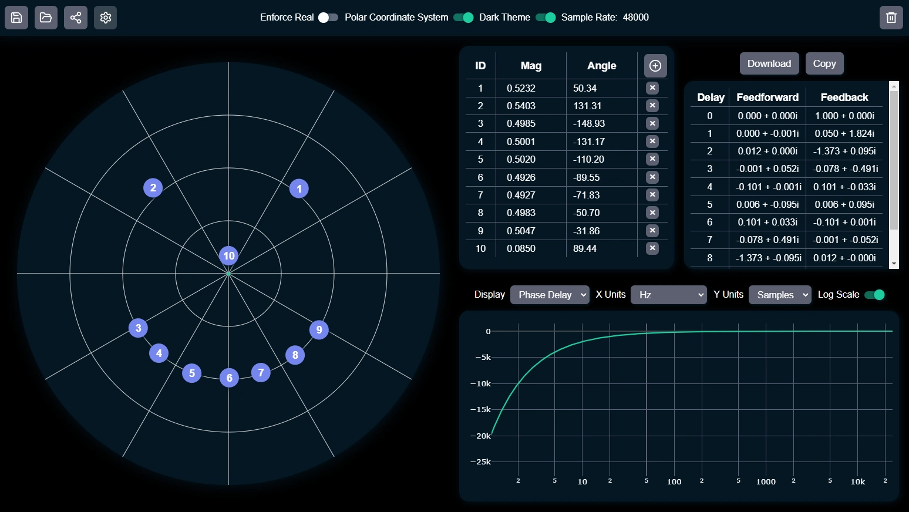

# All-Pass Designer

An interactive web app for designing all-pass filters by directly manipulating poles on the unit circle. Built for educational and DSP prototyping use, it provides a visual and intuitive interface to create, modify, and export filter configurations in real time.



## ✨ Features

- **Interactive Pole Placement**  
  Add, move, and delete poles by clicking or dragging within the unit circle.

- **Real-Time Phase Response**  
  Instantaneous visualization of the phase response (with unwrapped phase delay), updated with every change.

- **Two-Way Editing**  
  Edit pole positions either visually or numerically in the table (supports both rectangular and polar coordinate systems).

- **Automatic Stability & Conjugation**  
  Enforces stability by constraining poles inside the unit circle. When enabled, complex poles are automatically paired with their conjugates to ensure real-valued output.

- **Export Options**  
  Download or copy the resulting feedforward and feedback coefficients for use in other applications.

- **Persistent & Shareable State**  
  Save/load designs locally or share filter configurations via URL encoding.

- **Dark Mode & Grid Style Toggles**  
  Choose between light/dark themes and Cartesian or polar grids.

## 📦 Installation

To run locally:

```bash
git clone https://github.com/yourusername/all-pass-designer.git
cd all-pass-designer
npm install
npm run dev
```

## 📋 To Do List
- Improve styling and UI
- Plot: frequency axis with editable nyquist, Phase in degrees
- Plot: log toggle
- Plot: Drop-down to select between phase, phase delay, group delay
- Improve annoying inputs in table

- Listen to result in real-time
- Export as Biquads
- Stereo Design Mode
- Lock pole components
- Fit to reference

## ⚖️ License
Licensed under the Polyform Noncommercial License 1.0.0. See LICENSE file for details.
